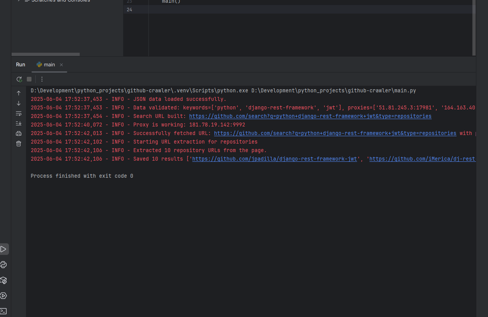
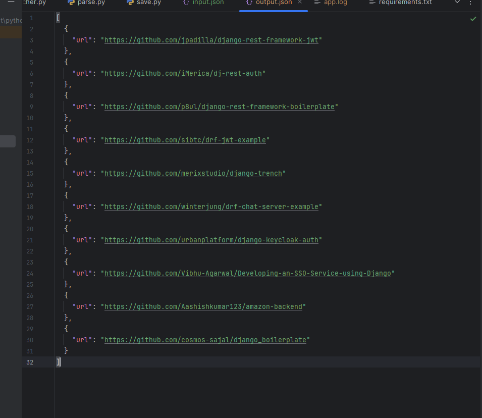

# GitHub Crawler


## Description
A Python project that searches GitHub using keywords and shows the first page of results as links. It uses proxies to make requests and works without using the GitHub API.


## Technologies Used
- Python
- BeautifulSoup
- Logging
- Pytest


## Features
- 
- 
- 


## Setup
To install the project locally on your computer, execute the following commands in a terminal:
```bash
git clone https://github.com/Illya-Maznitskiy/github-crawler.git
cd github-crawler
python -m venv venv
venv\Scripts\activate (on Windows)
source venv/bin/activate (on macOS)
pip install -r requirements.txt
```


## Run the project
Use the following commands to start the script:
```bash
python main.py
```


# Screenshots:

### Logging


### Output

